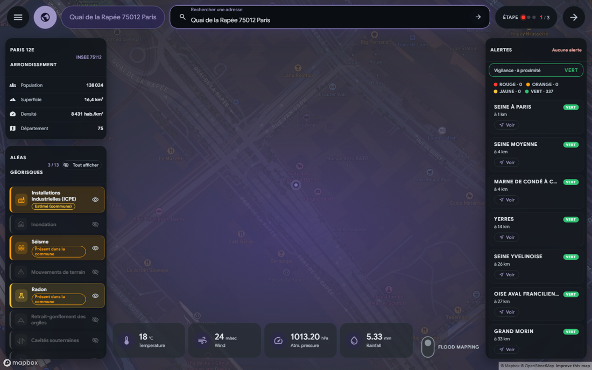
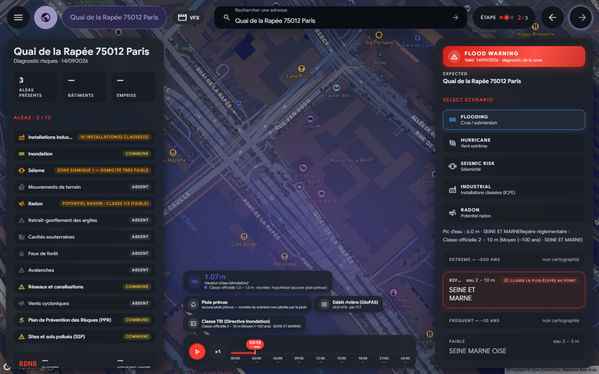

# Typhoon 2 — Données climatiques par bâtiment


Service de données climatiques **par bâtiment** pour les assureurs français.
Une adresse → un JSON canonique joignant aléas réglementaires (Géorisques,
point-in-polygon WFS) et vulnérabilité BDNB (139 champs verbatim), avec
**provenance et niveau de résolution sur chaque fait**.

> Pas de score, pas de narration IA, pas de recommandations : l'assureur
> applique son propre modèle actuariel (voir `constitution.md` §2).

## Aperçu

| Étape 1 — Diagnostic | Étape 2 — Scénarios |
|---|---|
|  |  |

*À gauche : 13 aléas Géorisques, fiche BDNB, photo Panoramax sur carte 3D.
À droite : classes TRI officielles (moyen ~100 ans, extrême ~500 ans…),
timeline horaire et Play — l'eau monte sur le bâtiment.*

## Fonctionnalités

### Étape 1 — Diagnostic (`/zone`)
- Recherche d'adresse (géocodage BAN) → carte 3D Mapbox avec bâtiments BDNB
- 13 aléas Géorisques (ICPE, inondation, sismique, PPR, radon, argile,
  cavités, feux, avalanches, canalisations, vent cyclonique, SSP, mouvements
  de terrain) avec badge de résolution : `per-building` (vérifié par test
  géométrique WFS) / `commune-level` (décret) / `commune-level-estimate`
- Fiche BDNB du bâtiment (usage, hauteur, emprise, matériaux, fiabilité adresse)
- Photo terrain Panoramax orientée sur le point
- Vigilances crues (Vigicrues) par bassin versant
- Historique CatNat et watchlist assureur (localStorage)

### Étape 2 — Simulation de scénarios
- **Classes TRI officielles** (Directive Inondation) : fréquent ~10 ans,
  moyen ~100 ans, extrême ~500 ans, faible — profondeur d'eau réglementaire
  au point, jamais inventée
- Timeline horaire + bouton Play : l'eau monte sur le bâtiment (extrusion
  Mapbox), le scénario pilote le pic, la pluie prévue n'en pilote que la forme
- Journée sèche → rampe divergée documentée, libellé « montée : hypothèse »
- Absence ≠ panne : « hors TRI », « dans un TRI sans classe au point » et
  « service indisponible » sont trois messages distincts
- Aléa feu : cône d'exposition orienté vent réel sur la carte
- Mode VFX optionnel (rendu cinématique non contractuel, toujours `partial`)
- Rapport PDF exportable (jsPDF) avec graphiques et provenance

### Backend — API FastAPI
| Route | Description |
|---|---|
| `POST /diagnostic/adresse` | Adresse → DiagnosticRecord canonique |
| `POST /diagnostic/batch` + `GET /diagnostic/batch/{id}` | Batch = N × pipeline unitaire |
| `GET /diagnostic/adresse/rapport-pdf` | Rapport PDF |
| `GET /diagnostic/zone/building(s)` | Fiches BDNB autour du point |
| `GET /api/flood-alea` | Classes TRI au point (Géorisques WFS, point-in-polygon) |
| `GET /api/hydro`, `/api/hydro/extend` | Tracé hydrographique (Sandre) |
| `GET /api/meteo` | Pluie horaire + débit GloFAS (Open-Meteo) |
| `GET /api/photo` | Photo Panoramax + crédit |
| `GET /api/report`, `/api/report/stream` | Rapport narratif (Mistral, template si clé absente) |
| `GET /api/geocode/search` | Autocomplétion BAN |
| `GET /health`, `/health/detailed` | Sonde de vie |

## Démarrage rapide

```bash
# Backend (Python 3.11+)
cd backend
python -m venv venv && venv/Scripts/activate   # ou source venv/bin/activate
pip install -r requirements.txt
uvicorn app.main:app --reload --port 8000

# Frontend (Node 18+)
cd frontend
npm install
npm run dev        # http://localhost:5173
```

Copier `.env.example` vers `.env` **à la racine du dépôt** (le frontend lit
les variables `VITE_*` depuis là via `envDir: '..'`) et renseigner :

| Variable | Usage |
|---|---|
| `VITE_MAPBOX_TOKEN` | Jeton public Mapbox (étape 1 & 2) |
| `VITE_SUPABASE_URL` / `VITE_SUPABASE_PUBLISHABLE_KEY` | Auth |
| `VITE_WINDY_API_KEY` | Overlay météo |
| `MISTRAL_API_KEY` | Prose du rapport (sinon rendu template) |
| `CDSAPI_KEY` / `CDSAPI_URL` | Copernicus CDS |
| `PARTNER_API_KEYS` | Endpoints fermés si absent (mode dev) |

## Démo — adresses de référence (vérifiées live 2026-09-14)

| Adresse | Rôle | Résultat vérifié |
|---|---|---|
| **Quai de la Rapée, 75012 Paris** | Démo principale — eau sur le bâtiment | `available: true` · Moyen 0–1 m · Faible 2–3 m · bassin Seine |
| **10 Quai de la Charente, 75019 Paris** | Absence honnête — dans un TRI sans classe au point | `in_tri: true`, 6/13 aléas, fiche BDNB 699 m² |
| Adresse intérieure hors TRI (ex. Brou, 28300) | Contraste « hors TRI ≠ jamais inondé » | `available: false, in_tri: false` |

Déroulé suggéré : Rapée (diagnostic → étape 2 → Moyen → scrub → Play) →
Charente (rigueur : message distinct, aucun chiffre inventé) → hors TRI →
export PDF.

## Tests & qualité

```bash
# backend (depuis backend/)
python -m pytest tests/ -q     # 214 tests hors-ligne, < 60 s
ruff check app tests

# frontend (depuis frontend/)
npm test                       # 143 tests vitest
npm run build                  # tsc -b && vite build
```

Captures d'écran (rejouables) :

```bash
cd frontend && node scripts/demo-shots.mjs   # nécessite backend + vite en local
```

La suite est **hors-ligne** (fixtures GML capturées, sources mockées) et doit
rester verte avant tout commit. Les tests live Géorisques sont un tiers séparé.

## Architecture

```
backend/
  app/api/routes/        diagnostic, flood, hydro, photo, report, geocoding, health
  app/connectors/        bdnb, georisques (REST + WFS per-building), flood_alea
                         (classes TRI), hydro (Sandre), meteo (Open-Meteo),
                         copernicus, geocoding (BAN), site_photo (Panoramax)
  app/services/          canonical (pipeline unitaire), batch, budget, limits,
                         report_agent (Mistral + cache)
  app/schemas/           diagnostic_record (contrat sérialisé, refuse les
                         champs interdits), flood, report
  app/core/              config, logging, api_key, rate_limit

frontend/
  src/routes/            Zone (/zone), ReportPage, Dashboard, Portfolio, WatchlistPage…
  src/components/        UnifiedMap (Mapbox 3D), ScenarioPanel, RiskConsole,
                         FloodConsole, RiskPanel, VfxDisclaimer…
  src/zone/              moteur scénario : floodAlea (client TRI), floodSim
                         (scenarioDepthAt), damageModel, impactModel, hazardSim,
                         windSim, exposure, hydroRoute, hydroLayer, pdf-export
  src/typhoon/           chrome applicatif, auth, navigation
```

### Principes non négociables (constitution.md)
- Chaque objet aléa porte `source` + `resolution` + attribution LO 2.0
- Interdits dans le contrat sérialisé : bandes/scores D03, recommandations IA,
  tout score composite — le schéma backend les refuse
- Batch = N × `build_diagnostic_record`, aucune seconde implémentation bulk
- RGA toujours `commune-level-estimate` tant qu'aucune source vectorielle
  n'est câblée (amendement requis pour changer)
- Quotas upstream protégés côté client (BDNB 120 req/min, Géoplateforme 50 req/s)
- Clés API jamais journalisées

### Pièges connus (AGENTS.md — à lire avant toute modification)
- Le WFS Géorisques exige un `AsyncClient` **dédié** (keep-alive lié au
  backend ; mélanger REST/WFS provoque des 404 en cascade)
- GML 3.2 uniquement ; ordre d'axes (lat, lon) quand `srsName` URN EPSG::4326 ;
  le `srsName` peut vivre sur l'`Envelope`/`MultiSurface` sans se répéter sur
  chaque `Polygon` — l'hériter, sinon point-in-polygon ne matche jamais
- Une réponse WFS vide est **ambiguë** (hoquet MapServer) : rejouer une fois
- Arrondissements Paris/Lyon/Marseille : retranslater vers la commune parente
- Géocodeur : 429 + Retry-After à 50 req/s/IP — helper `_get_with_429_retry`

## Déploiement

**Option A — Tout sur Vercel (un seul projet, recommandé)** : le frontend est
servi en statique, le backend FastAPI tourne en fonction serverless derrière
des rewrites — une seule URL, pas de CORS à gérer.

### A. Vercel monorepo (tout-en-un)

Le `vercel.json` à la racine fait tout (le `package.json` racine préexistant
n'est pas utilisé par Vercel : le build installe et compile `frontend/`) :

- build : `cd frontend && npm install && npm run build` → servi depuis
  `frontend/dist`
- rewrites `/api/*`, `/diagnostic/*`, `/health` (+ `/health/*`) → `api/index.py`
  (fonction Python qui monte `backend/app/main.py`) — la géocodification vit
  sous `/api/geocode/*`, donc déjà couverte
- le frontend appelle le backend **en même origine** (URLs relatives
  `${API}/api/...`) dès que la page n'est pas servie depuis un hôte local :
  aucune URL à configurer, aucun CORS. Un `VITE_API_BASE` qui pointe vers
  `http://127.0.0.1:8000` est **ignoré en production** (il désignerait la
  machine du visiteur, d'où « backend inaccessible ? »)

1. Sur [vercel.com](https://vercel.com) : **Add New → Project** → importer le
   dépôt. **Root Directory : laisser VIDE** (la racine du dépôt).
2. Framework Preset : **Other**.
3. Variables d'environnement (production) :

   | Variable | Valeur |
   |---|---|
   | `VITE_API_BASE` | **absent** (recommandé). Override possible si le backend est ailleurs ; une valeur loopback (`http://127.0.0.1:8000`) est sans effet en production |
   | `VITE_MAPBOX_TOKEN` | jeton Mapbox |
   | `VITE_SUPABASE_URL` / `VITE_SUPABASE_PUBLISHABLE_KEY` | auth |
   | `VITE_WINDY_API_KEY` | optionnel |
   | `MISTRAL_API_KEY` / `MISTRAL_MODEL` | prose du rapport (backend) |
   | `CORS_ALLOWED_ORIGINS` | l'URL Vercel finale (ex. `https://typhoon.vercel.app`) — inutile en option A car même origine, mais sans risque |

4. Déployer. Vérifier :

   ```bash
   curl https://<projet>.vercel.app/health
   curl "https://<projet>.vercel.app/api/flood-alea?lat=48.848&lon=2.370" | head -c 200
   ```

   (Le réveil d'une fonction froide prend quelques secondes — normal sur le
   plan gratuit.)

### B. Deux hôtes (Render + Vercel) — si les fonctions serverless sont trop lentes

**Backend sur Render** (blueprint `render.yaml` prêt) :

1. [render.com](https://render.com) : **New → Blueprint** → choisir le dépôt.
2. Env : `CORS_ALLOWED_ORIGINS=https://<votre-app>.vercel.app`, optionnel
   `MISTRAL_API_KEY`.
3. Deploy → `https://typhoon-api-xxxx.onrender.com` (health `/health`).
   Plan gratuit : s'endort après 15 min (~30 s de réveil) — un ping
   UptimeRobot sur `/health` le garde éveillé pour une démo.

**Frontend sur Vercel** :

1. **Root Directory : `frontend`** (le `frontend/vercel.json` gère le fallback
   SPA).
2. Env : `VITE_API_BASE=https://typhoon-api-xxxx.onrender.com` + les
   `VITE_MAPBOX_TOKEN` / `VITE_SUPABASE_*` ci-dessus.
3. Déployer, puis reporter l'URL Vercel finale dans Render
   `CORS_ALLOWED_ORIGINS` (boucle de retour).

```bash
curl https://<render-url>/health
curl "https://<render-url>/api/flood-alea?lat=48.848&lon=2.370" | head -c 200
# puis ouvrir l'URL Vercel et diagnostiquer « Quai de la Rapée, Paris »
```

## Documentation

- `constitution.md` — règles non négociables (amendement avant spec)
- `AGENTS.md` — méthodologie spec-driven, invariants acquis, pièges
- `docs/workflow/` — spec, plans (scénarios SCN-xxx, VFX), notes de décision
- `handoff.md` — décisions architecturales en attente

## Licence

MIT — voir [LICENSE](LICENSE).

## Convention de commit

Messages concis, préfixés du domaine : `feat(etape2): …`, `fix(flood): …`,
`test(SCN-xxx): …`, `docs: …`, `chore: …`. Un commit `test(TXXX)` échouant
puis un commit `feat(TXXX)` pour toute feature (workflow spec-driven).
