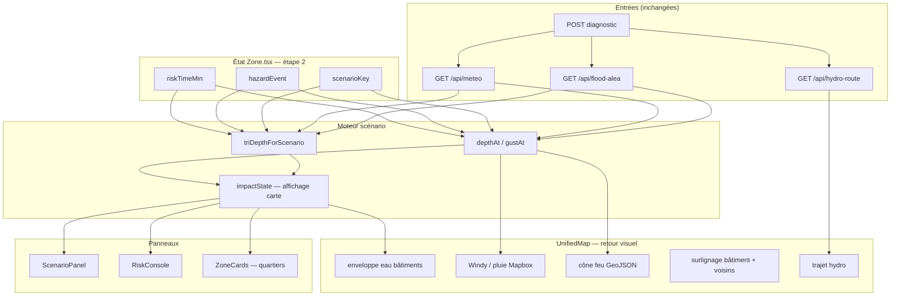

# Plan — Scénarios interactifs `/zone` (référence FuseLab)

**Spec:** `docs/workflow/scenario-spec.md` (à rédiger si le contrat détaillé manque — ce plan en tient lieu pour l’exécution)  
**Référence produit:** [Fuselab — Flood Impact](https://fuselabcreative.com/our-projects/flood-damage/)  
**Statut:** approved — prêt pour implémentation  
**Conventions:** tâches `SCN-00N` ; commits `test(SCN-00N): …` puis `feat(SCN-00N): …` ; ne pas modifier les tests existants pendant une tâche feature (constitution §4).

---

## Problème

L’UI `/zone` imite FuseLab (panneau scénarios, timeline, grille de membres, console basse) mais **la boucle scénario → carte ne fonctionne pas** :

| Attendu (FuseLab) | État actuel |
|-------------------|-------------|
| Choisir un scénario → l’eau monte sur la carte | **Cassé** — lookup TRI toujours `null` (clés UI incohérentes) |
| Timeline → changement visible en direct | Timeline OK en UI, **carte souvent sèche** |
| Ouragan / vent → effet sur la carte | **Chiffres console seulement** — pas de couche météo à l’étape 2 |
| Feu → simulation visible | **SVG 150 px dans le panneau** — rien sur la carte |
| Bâtiments mis en évidence par état | **Accent sur le bâtiment diagnostiqué seulement** |
| Cartes quartier (« Downtown — moderate flooding ») | **Non implémenté** |

Ce plan répare d’abord la **simulation fonctionnelle** (Mapbox + données réelles). Le mode VFX Three.js (`docs/workflow/vfx-plan.md`) reste une couche optionnelle **après** que cette boucle marche.

---

## Architecture cible



**Principe :** un seul bus d’état (`scenarioKey`, `hazardEvent`, `riskTimeMin`). Chaque aléa branche un **renderer carte** distinct ; les panneaux lisent le même moteur.

---

## Cause racine #1 — clés de scénario incohérentes

| Module | Clés utilisées |
|--------|----------------|
| `damageModel.SCENARIOS` | `extreme`, `moyen`, `frequent`, `faible` |
| `ScenarioPanel`, `Zone.tsx` (défaut `'extreme'`) | idem |
| `UI_SCENARIO_TRI_KEY` | `direct`, `west`, `east`, `offshore` |
| `triDepthForScenario(floodAlea, 'extreme')` | → `undefined` → **null** |

**Décision (SCN-001) :** les clés UI **sont** les clés TRI (`extreme` | `moyen` | `frequent` | `faible`). Supprimer l’indirection `direct/west/east/offshore` ou la réduire à un alias documenté. Une seule source de vérité : `damageModel.SCENARIOS[].key`.

---

## Cause racine #2 — seuil 0,3 m masque la carte

`riskImpact` n’est passé à la carte que si `impactState.overThreshold` (≥ 0,3 m). FuseLab montre la montée dès le début.

**Décision (SCN-002) :** seuil 0,3 m = **dommages / infra / tuiles « inondé »** uniquement. La **carte** peint l’eau dès `depthM > 0` (ou dès `depthFractionAt > 0.05`).

---

## Cause racine #3 — météo absente à l’étape 2

`FloodConsole` (Windy) est masqué en `.risk-open` ; `RiskConsole` ne pilote aucune couche vent/pluie sur la carte.

**Décision (SCN-020) :** en mode `HURRICANE`, réactiver une couche météo synchronisée à `riskTimeMin` (Windy overlay ou `setRain` + particules Mapbox).

---

## Task list

### SCN-001 — Unifier les clés scénario TRI

- **Depends on:** —
- **Estimate:** 2 h
- **Files:** `frontend/src/zone/floodAlea.ts`, `frontend/src/zone/floodAlea.test.ts`, `frontend/src/routes/ReportPage.tsx` (DEFAULTS `direct` → `extreme`)
- **Acceptance criteria:**
  - [x] `triDepthForScenario(tri, 'extreme'|'moyen'|'frequent'|'faible')` résout le bon `TriScenario`
  - [x] `UI_SCENARIO_TRI_KEY` supprimé ou réduit à alias deprecated avec tests de non-régression
  - [x] `Zone.tsx` défaut `scenarioKey = 'extreme'` produit un `triPeak` non null sur fixture TRI connue (`scenarioLoop.test.ts`)
  - [x] Tests mis à jour **dans ce change set uniquement** (`floodAlea.test.ts` — correction du bug documenté)

  **Implémenté :** `SCENARIO_TRI_KEY` (identité + alias dépréciés) ; `triScenarioKeyFor()` ; `UI_SCENARIO_TRI_KEY` conservé comme alias `@deprecated` ; `ReportPage` `DEFAULTS.scenarioKey: 'extreme'`.
- **Tests to write first:**
  - `triDepthForScenario` avec clés `extreme`, `moyen`, `frequent`, `faible`
  - régression : clé inconnue → `null`

---

### SCN-002 — Seuil carte vs seuil dommages

- **Depends on:** SCN-001
- **Estimate:** 2 h
- **Files:** `frontend/src/routes/Zone.tsx`, `frontend/src/zone/impactModel.ts` (doc comment seulement si possible)
- **Acceptance criteria:**
  - [x] Nouveau helper `mapImpactState(depthM, peakM)` ou flag `forMap: true` : peint dès `slabM > 0`
  - [x] `impactState.overThreshold` reste à 0,3 m pour panneaux dommages / tuiles scénario
  - [x] Scrub timeline à t₀ → eau visible sur la carte (faible opacité), compteur infra peut rester « sous seuil »

  **Implémenté :** `MAP_MIN_DEPTH_M = 0.02` + `mapImpactFromDepth(depthM, peakM) → MapImpact | null` ; `Zone.riskImpact` l'utilise. Le sens de « t₀ » est documenté : sous 2 cm le résidu numérique ne peint rien.
- **Tests to write first:**
  - `mapImpactFromDepth` — 0,1 m → `{ slabM, color, visible: true }` ; panneau dommages inchangé

---

### SCN-003 — Diagnostic : chargement explicite TRI + météo

- **Depends on:** SCN-001
- **Estimate:** 2 h
- **Files:** `frontend/src/routes/Zone.tsx`, `ScenarioPanel.tsx`, `RiskConsole.tsx`
- **Acceptance criteria:**
  - [x] État `triLoading` / `meteoLoading` ou réutilisation de `loading`
  - [x] Échec `fetchFloodAlea` → message visible (« hors TRI » ou « service indisponible »), pas une grille silencieuse à 0 m
  - [x] Échec météo → « Simulation indisponible » cohérent console + panneau

  **Implémenté :** `triStatus` (`loading | ok | unavailable`) dans `Zone.tsx`, transmis au panneau via `triFailed` : **deux messages distincts** — « Point non cartographié · Hors zone TRI » (fait) vs « Service indisponible · la cartographie TRI n'a pas répondu » (panne).
  La météo n'a **pas** de drapeau dédié : son absence est déjà lisible dans la donnée (`meteo === null`, `dry`) et la console en dérive « Simulation indisponible » — un second état serait dormant (cf. constitution §2).
- **Tests to write first:**
  - test composant : `floodAlea.available === false` → rangs TRI affichent message unique (comportement existant verrouillé)

---

### SCN-010 — Boucle inondation carte ↔ timeline

- **Depends on:** SCN-002
- **Estimate:** 4 h
- **Files:** `Zone.tsx`, `UnifiedMap.tsx`, `RiskConsole.tsx`
- **Acceptance criteria:**
  - [x] Étape 2 + `FLOODING` + TRI + pluie → `impact` non null sur la carte quand `depthM > 0`
  - [x] Scrub `riskTimeMin` → hauteur extrusion eau change sans rechargement réseau
  - [x] Clic rang scénario (EXTREME / REFERENCE / …) → `triPeak` change → pic d’eau instantané
  - [x] `RiskConsole` affiche la même profondeur que la carte

  **Implémenté :** la boucle est réparée par SCN-001 + SCN-002 ; `scenarioLoop.test.ts` verrouille la chaîne complète (clé → classe TRI → pic → pluie → profondeur → eau dessinée) pour **chaque** clé du moteur, y compris l'ordre d'intensité, la montée au scrub et les cas « rien à peindre ». `UnifiedMap.applyImpact` n'avait pas de seuil propre (il peint dès `slab > 0`) — seuls les commentaires ont été mis à jour.
- **Tests to write first:**
  - `Zone.scenarioLoop.test.tsx` — mock `floodAlea` + `meteo` → `riskImpact.slabM > 0` à mi-journée

---

### SCN-011 — Bouton « Play scenario »

- **Depends on:** SCN-010
- **Estimate:** 3 h
- **Files:** `RiskConsole.tsx` ou `ScenarioPlayControls.tsx`
- **Acceptance criteria:**
  - [x] Bouton Play : auto-incrémente `riskTimeMin` de 0 → heure pic pluie (`rainProfile.peakIndex`) à 1× / 4× / 16×
  - [x] Pause / reprise ; fin → hold 2 s au pic
  - [x] Play désactivé si `!hasSim`

  **Implémenté :** `peakMin` (pic pluie en mode crue, pic de rafale en mode vent) ; l'ancienne lecture **bouclait** à 00:00, elle s'arrête désormais sur le pic réel puis met en pause après 2 s. Reprise depuis minuit si le curseur est déjà au-delà du pic. `disabled={!hasSim}` + infobulle explicative.
- **Tests to write first:**
  - timer mock : play avance `onTimeChange`

---

### SCN-012 — Surlignage bâtiment héros + voisins

- **Depends on:** SCN-010
- **Estimate:** 4 h
- **Files:** `UnifiedMap.tsx`, `styles/zone.css`
- **Acceptance criteria:**
  - [ ] Bâtiment diagnostiqué : extrusion accent + contour lumineux + pin (existant renforcé)
  - [ ] Bâtiments voisins dans bbox : teinte eau synchronisée (même `slabM` — enveloppe uniforme assumée)
  - [ ] Legende courte : « Enveloppe modèle — profondeur uniforme au secteur »
- **Tests to write first:** smoke manuel ; test unitaire couleur extrusion si helper extrait

---

### SCN-020 — Ouragan : retour visuel sur la carte (étape 2)

- **Depends on:** SCN-003
- **Estimate:** 5 h
- **Files:** `UnifiedMap.tsx`, `Zone.tsx`, `RiskConsole.tsx`
- **Acceptance criteria:**
  - [ ] `hazardEvent === 'HURRICANE'` + étape 2 → overlay vent Windy OU `setRain` + densité liée à `gustAt`
  - [ ] `riskTimeMin` pilote l’heure de l’overlay (comme étape 1)
  - [ ] `impact` forcé à `null` (pas d’eau) ; console affiche rafale + bande
  - [ ] Pic de rafales → pulse visuel léger sur surlignage bâtiment (opacity animation CSS)
- **Tests to write first:**
  - `UnifiedMap.hurricaneMode.test.tsx` — prop `hazardEvent='HURRICANE'` n’appelle pas `applyImpact`

---

### SCN-021 — Feu : cône sur la carte

- **Depends on:** SCN-003
- **Estimate:** 5 h
- **Files:** `frontend/src/zone/hazardSim.ts`, `UnifiedMap.tsx`, `ScenarioPanel.tsx`
- **Acceptance criteria:**
  - [x] Export `fireConePolygon(meteo, originLonLat)` → GeoJSON polygon
  - [x] Couche Mapbox `fill` + `fill-extrusion` faible, orientée vent réel
  - [x] Panneau conserve SVG ou délègue à la carte (carte = source de vérité visuelle)
  - [x] Sans météo → pas de cône, message explicite

  **Implémenté :** `fireConePolygon()` (GeoJSON Feature, cap = provenance + 180°, portée bornée par `FIRE_REACH_MAX_KM = 1.5 km`, ouverture héritée de `fireConeFrom`) ; couche Mapbox `fire-cone-fill` / `fire-cone-line` (translucide, pointillés — une zone d'EXPOSITION, pas une emprise de flammes). Le cône n'est monté que si `hazardEvent === 'FIRE'` **et** `feu_foret.present === true` au diagnostic. Le panneau garde sa vignette SVG.
  *Écart assumé vs plan :* couche `fill` + `line` plutôt que `fill-extrusion` (un volume 3D sur un cône d'exposition suggérerait une précision qui n'existe pas).
- **Tests to write first:**
  - `fireConePolygon.test.ts` — vent connu → polygone non vide, orientation cohérente

---

### SCN-030 — Cartes quartier (FuseLab « Metropolitan Center »)

- **Depends on:** SCN-010
- **Estimate:** 8 h
- **Files:** `frontend/src/components/ZoneCards.tsx` (nouveau), `LeftPanels.tsx` ou `RiskPanel.tsx`, `Zone.tsx`
- **Acceptance criteria:**
  - [ ] 4 cartes : bâtiment cible + 3 empreintes BDNB voisines (même bbox viewport)
  - [ ] Libellés dérivés : adresse tronquée / « Bâtiment adjacent N »
  - [ ] État live : « Sec », « Eau 0,4 m », « Inondé 1,2 m » selon `depthM` et seuil 0,3 m
  - [ ] Clic carte → `flyTo` empreinte
  - [ ] Sync timeline : cartes se mettent à jour avec `riskTimeMin`
- **Tests to write first:**
  - `zoneCardLabel.test.ts` — profondeur → libellé état

---

### SCN-040 — Trajet hydro + scénario (optionnel mais wow)

- **Depends on:** SCN-011
- **Estimate:** 4 h
- **Files:** `waterFlight.ts`, `Zone.tsx`, `RiskConsole.tsx`
- **Acceptance criteria:**
  - [ ] Bouton « Suivre l’eau » lance `WaterFlight` + sync progression → `riskTimeMin` (option couplée ou séquentielle)
  - [ ] Marqueur goutte + tracé révélé (existant `hydroLayer`) visible pendant play
- **Tests to write first:** tests existants `hydroRoute` / `waterFlight` restent verts

---

### SCN-050 — Documentation & AGENTS

- **Depends on:** SCN-010 minimum
- **Estimate:** 1 h
- **Acceptance criteria:**
  - [x] `AGENTS.md` référence ce plan
  - [x] Commentaire en tête de `damageModel.ts` / `floodAlea.ts` aligné sur clés unifiées
  - [ ] Manual smoke checklist dans ce fichier (section ci-dessous) validée

  **Restant :** la checklist ci-dessous n'a **pas** été exécutée sur une adresse réelle — elle demande un jeton Mapbox, une adresse certifiée TRI et une journée avec pluie prévue. À faire en qualification avant de considérer PR-1/PR-2 « done ».

---

## Ordre d’exécution

```
SCN-001 ── SCN-002 ── SCN-003
              │
              ├── SCN-010 ── SCN-011
              │       │
              │       ├── SCN-012
              │       ├── SCN-030
              │       └── SCN-040
              │
              ├── SCN-020
              └── SCN-021

SCN-050 après SCN-010
```

**PRs suggérés :**

| PR | Tâches | Livrable utilisateur |
|----|--------|----------------------|
| **PR-1** | SCN-001, SCN-002, SCN-003 | Scénarios TRI branchés ; eau visible sur carte |
| **PR-2** | SCN-010, SCN-011, SCN-012 | Timeline + Play ; bâtiment mis en évidence |
| **PR-3** | SCN-020, SCN-021 | Vent et feu visibles sur la carte |
| **PR-4** | SCN-030, SCN-040, SCN-050 | Cartes quartier + vol caméra rivière |

---

## Risk log

| Tâche | Risque | Mitigation |
|-------|--------|------------|
| SCN-001 | Casser `ReportPage` (`scenarioKey: 'direct'`) | Grep `direct`/`west`/`east`/`offshore` ; migrer en même PR |
| SCN-010 | Pas de TRI au point test | Adresse certifiée inondation dans checklist smoke |
| SCN-010 | Pas de pluie Open-Meteo | Mock dev ou adresse avec pluie prévue ; message UI |
| SCN-020 | Windy vs pitch 3D | Mercator + pitch 0 en vent, ou Windy seulement 2D avec pluie Mapbox |
| SCN-030 | BDNB voisins absents | Fallback 1 carte (bâtiment cible seul) |
| SCN-* | Modifier tests existants | SCN-001 est change set de **correction** — exception documentée |

---

## Definition of done

- [ ] SCN-001 à SCN-011 mergés (boucle inondation FuseLab-like minimale)
- [ ] `npm test` + `npm run build` verts (frontend)
- [ ] `python -m pytest tests/ -q` vert (backend inchangé sauf régression)
- [ ] Smoke manuel (adresse TRI + pluie) :

  1. Diagnostiquer une adresse en zone TRI connue  
  2. Passer à **étape 2**  
  3. Sélectionner **EXTREME ~500 ans** → pic d’eau affiché (panneau + console)  
  4. Scrubber timeline → **eau monte sur le bâtiment**  
  5. **Play** → animation automatique jusqu’au pic  
  6. Basculer **HURRICANE** → overlay vent/pluie sur carte, pas d’eau  
  7. Basculer **FIRE** (si `present`) → cône visible sur carte  

- [ ] Aucun champ interdit dans l’API (constitution §2 inchangée)

---

## Smoke addresses (à compléter en qualification)

| Adresse | TRI attendu | Usage |
|---------|-------------|-------|
| *(à renseigner — certificat T008 inondation)* | ≥1 scénario cartographié | SCN-010 |
| *(hors TRI)* | `available: false` | SCN-003 message |
| *(vent côtier)* | météo rafales | SCN-020 |

---

## Hors scope (ce plan)

- Mode VFX Three.js (`vfx-plan.md`) — après SCN-010 vert  
- Simulation hydraulique terrain (DEM routing) — produit différent  
- Scores / recommandations IA — interdit §2  
- Nouveaux endpoints backend (sauf corrections bug `/api/flood-alea`)

---

## Lien avec VFX

| Phase scénario | Phase VFX |
|----------------|-----------|
| SCN-010 boucle eau Mapbox fonctionne | VFX-004 terrain plane **remplace** l’extrusion, mêmes entrées `depthAt` |
| SCN-011 Play scenario | VFX-007 `VfxDirector` **enrichit** la caméra |
| SCN-030 cartes quartier | Inchangé en VFX (restent data-honest) |

**Ne pas démarrer VFX-004 tant que SCN-001 + SCN-010 ne sont pas verts.**

---

## Addendum — SCN-004 : « rien ne se passe » (correctif après mise en service)

Constaté sur une adresse réelle (Paris), après SCN-001..003 : **le bouton de lecture
restait inerte et changer de scénario ne produisait rien.** Deux causes distinctes,
toutes deux vérifiées sur données réelles :

| Cause | Preuve | Correctif |
|-------|--------|-----------|
| Le niveau d'eau dépendait de la PRÉVISION DE PLUIE du jour. À Paris : `dry: true`, `rain_total_mm: 0` → `rainProfileFrom()` = null → `depthAt()` = 0 → aucune eau, bouton grisé. | appel réel `fetch_meteo` | **SCN-004a** : le scénario pilote le niveau |
| Le scénario ouvert par défaut (`extreme`) n'était pas cartographié au point : à Paris seule la classe `faiable` l'est. `triPeak` = null → aucune eau. | appel réel `resolve_flood_alea` | **SCN-004b** : sélection par défaut = classe la plus intense cartographiée |

### SCN-004a — le scénario pilote le niveau, la pluie ne pilote que la forme

Un **scénario réglementaire choisi ne peut pas être invisible parce qu'il ne pleut
pas aujourd'hui** : la classe TRI est un fait, la pluie une circonstance. Nouveau
`scenarioDepthAt()` (identique à `depthAt` quand la pluie existe) ; sans pluie, une
rampe documentée (`scenarioRampAt`, 5 % → pic à 24 h) prend le relais et l'UI déclare
« montée : hypothèse (aucune pluie prévue) ».

- `depthAt` reste exporté `@deprecated` (météo-dépendant) — ne plus l'utiliser comme
  source du niveau.
- **Interdit inchangé** : hors TRI / aucune classe → 0 m. Le pic n'est jamais deviné.
- Le mode VFX consomme le **même** `scenarioDepthAt` : data et VFX ne peuvent plus
  afficher deux hauteurs différentes. La constante de repli 1,0 m prévue par VFX-003
  est **supprimée** (incohérente et inatteignable) : le repli ne porte plus que sur
  la FORME de la courbe.

### SCN-004b — sélection par défaut utile

`mostIntenseMappedScenario(tri, ordre)` bascule sur la classe la plus intense
réellement cartographiée, **une fois par diagnostic** (garde par `ref`), pour ne pas
annuler un choix explicite. Les rangs non cartographiés sont désormais `disabled` avec
infobulle. Le badge « Most probable » de la maquette devient « Classe la plus élevée au
point » et suit les données, au lieu de marquer en dur le rang `extreme`.

### Tests

`scenarioLoop.test.ts` : journée sèche → eau dessinée + pic exact de classe (1,5 m) ;
hors TRI → toujours rien ; aucune classe → rien ; `mostIntenseMappedScenario` sur les
trois cas (seule « faible » cartographiée / plusieurs / aucune).
`RiskConsole.test.tsx` : lecture active sans pluie, désactivée sans classe TRI.
